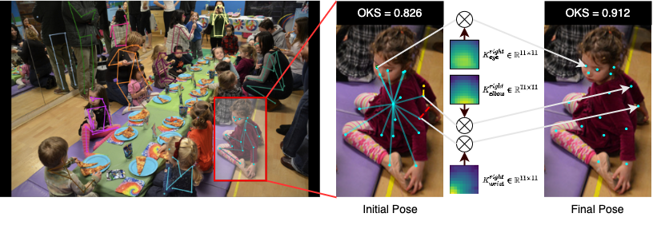

# Learning Local-Global Contextual Adaptation for Multi-Person Pose Estimation (CVPR 2022)
**This is the offical repo of [our paper](https://arxiv.org/abs/2109.03622).** 

**Abstract**: *This paper studies the problem of multi-person pose estimation in a bottom-up fashion.
With a new and strong observation that the localization issue of the center-offset formulation can be remedied in a local-window search scheme in an ideal situation, we propose a multi-person pose estimation approach, dubbed as LOGO-CAP, by learning the LOcal-GlObal Contextual Adaptation for human Pose. Specifically, our approach learns the keypoint attraction maps (KAMs) from the local keypoints expansion maps (KEMs) in small local windows in the first step, which are subsequently treated as dynamic convolutional kernels on the keypoints-focused global heatmaps for contextual adaptation, achieving accurate multi-person pose estimation. Our method is end-to-end trainable with near real-time inference speed in a single forward pass, obtaining state-of-the-art performance on the COCO keypoint benchmark for bottom-up human pose estimation. With the COCO trained model, our method also outperforms prior arts by a large margin on the challenging OCHuman dataset.*

<p align="center">

<p>

---

## Installation  (tested on Ubuntu-18.04, CUDA 11.1, pytorch-lts)

```
conda env create -f environment.yml
conda activate logocap
```

## Data Preparation 

Download [COCO](https://cocodataset.org/#download) and [OCHuman](https://github.com/liruilong940607/OCHumanApi) datasets into the  ``data directory`` with the following structure:
```
|-- data
|   |-- coco
|   |   |-- annotations
|   |   |-- images
|   |-- OCHuman 
|       |-- annotations
|       |-- images
```

## Model Weights for Training and Testing

Download the pretrain models of HRNet backbones for training and the trained models of our LOGO-CAP with HRNet backbones by the following scripts.
```
cd weights
sh download.sh
cd ..
```

## Citations
If you find our work useful in your research, please consider citing:
```
@inproceedings{LOGOCAP,
title = "Learning Local-Global Contextual Adaptation for Multi-Person Pose Estimation",
author = "Nan Xue and Tianfu Wu and Gui-Song Xia and Liangpei Zhang",
booktitle = "IEEE Conference on Computer Vision and Pattern Recognition (CVPR)",
year = {2022},
}
```